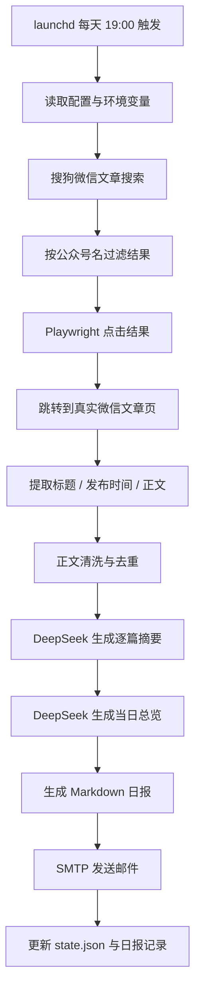

# 文旅公众号日报器项目流程复盘

## 1. 项目目标

这个项目的目标不是单纯“抓公众号”，而是完成一条可长期运行的日报生产链路：

- 监控指定公众号是否有新文章
- 抓取真实文章正文
- 调用 DeepSeek 生成结构化摘要
- 输出 Markdown 日报
- 通过 SMTP 自动发到邮箱
- 在 Mac 上每天 19:00 自动执行

当前实际接入的公众号有两个：

- `数字文旅观察`
- `上海文旅产业研究院`

## 2. 最初方案

一开始采用的是最直接、也最理想的思路：

1. 用 `Playwright` 启动持久化浏览器
2. 复用登录态访问公众号主页
3. 从公众号主页中读取最近文章列表
4. 打开新文章并提取正文
5. 生成摘要和日报

这个方案的优点很明显：

- 不依赖第三方搜索平台
- 逻辑最直接
- 如果公众号主页可访问，文章发现会更准确

## 3. 第一个现实问题：公众号主页并不对桌面浏览器开放

实际联调时发现，微信文章页可以打开，但公众号主页 `profile_ext` 链接在桌面浏览器环境下会直接返回：

- `请在微信客户端打开链接`

这意味着“公众号主页监控”这条路线在本项目运行环境里不可行。

这里要区分两件事：

- **代码 bug**：可以通过继续修改代码解决
- **平台访问限制**：不是继续调代码就能解决

这个问题属于第二类。

所以项目必须拆分为两个子问题分别解决：

- **如何发现新文章**
- **如何抓取文章正文**

## 4. 保留可用能力，替换不可用能力

虽然公众号主页不可访问，但真实微信文章页 `mp.weixin.qq.com/s?...` 仍然可以打开。

于是项目路线调整为：

- **发现文章**：不再依赖公众号主页，改走搜狗微信文章搜索
- **抓取正文**：继续使用真实微信文章页

这个调整不是“降低质量”，而是把能力拆分后替换掉不可用部分：

- 不可用：公众号主页文章列表
- 可用：真实微信文章页

也就是说，摘要和日报仍然建立在原始文章正文之上，而不是建立在搜狗搜索摘要之上。

## 5. 替代路线为什么成立

最终采用的链路是：

1. 先用搜狗微信文章搜索查目标公众号
2. 只保留账号名匹配的搜索结果
3. 用 Playwright 点击搜索结果
4. 跳转到真实微信文章页
5. 从真实页面中提取标题、发布时间、正文
6. 清洗正文并生成摘要

这个方案成立的关键原因是：

- 搜狗负责“发现”
- 微信文章页负责“原文”

所以第三方搜索只参与入口发现，不参与最终摘要内容生成。

## 6. 过程中遇到的关键问题与处理方式

### 问题 A：项目初始化被中文目录名卡住

现象：

- `npm init -y` 因目录名是中文，生成的包名非法

处理：

- 手工创建 [package.json](/Users/nafyoung/Documents/Codex%20Project/文旅新闻总结/package.json)

为什么这样做：

- 这是最小改动
- 不影响后续工程结构
- 避免为了初始化去改项目目录名

### 问题 B：从种子文章推导公众号主页 URL 时丢失了 `__biz`

现象：

- 状态文件里出现了无效主页地址  
  `https://mp.weixin.qq.com/mp/profile_ext?action=home&__biz=`

处理：

- 修复主页 URL 拼接逻辑
- 回退到 `bizId` 直接重建主页链接
- 增加测试，锁住这个问题

为什么这样做：

- 即使主页路线最终废弃，这个修复仍然能保证种子文章元数据提取正确

### 问题 C：校验页识别逻辑误伤了正常文章页

现象：

- 程序把正常微信文章页误判为“验证页”

处理：

- 收紧拦截页判断条件
- 区分微信文章页、搜狗反爬页、真正验证页

为什么这样做：

- 反爬判断必须保守，否则正常页面会被当成异常流量直接丢掉

### 问题 D：搜狗搜索结果可以找到文章，但无头模式容易触发反爬

现象：

- 后台自动运行时，搜狗会报反爬

处理：

- 自动化脚本改用 `headed` 模式
- 允许任务执行时短暂拉起浏览器窗口

为什么这样做：

- 这是在本机 Mac 环境下最现实、最稳妥的折中
- 比继续硬抗无头反爬更可靠
- 比接入更复杂的验证码服务更简单可维护

### 问题 E：搜狗中转到微信文章页后，发布时间和正文不是立刻可读

现象：

- 页面跳转成功，但提取时标题、发布时间、正文节点尚未完成注入

处理：

- 增加页面就绪等待
- 对搜狗中转链接额外等待数秒
- 等标题、发布时间、正文节点都可读后再提取

为什么这样做：

- 微信文章页前端是延迟渲染
- 如果不等，提取到的是不完整 DOM

### 问题 F：搜狗中转 URL 带签名参数，不适合做去重键

现象：

- 同一篇文章会对应多个带签名的中转 URL
- 直接按原始 URL 去重会出现重复

处理：

- 从真实文章页提取 `biz / mid / idx / sn`
- 重建更稳定的文章 URL
- 用稳定 URL 作为状态存储键

为什么这样做：

- 这样去重是基于微信文章身份，不是基于中转入口
- 比按标题去重更可靠

## 7. 为什么替代方案仍然能保证任务质量

这是整个项目最重要的一点。

项目没有为了“能跑”而牺牲摘要质量，原因有四个：

### 7.1 摘要基于真实微信原文

最终摘要输入来自真实微信文章页正文，而不是搜狗摘要。

这保证了：

- 信息完整性更高
- 摘要不会被搜索结果的截断文本污染

### 7.2 搜索只负责发现，不负责内容

搜狗只是用来找到文章入口。

真正用于日报生产的仍然是：

- 标题
- 发布时间
- 正文

这些都来自真实微信页面。

### 7.3 每个公众号支持独立搜索词

并不是所有公众号都能用“账号名”直接搜出精确结果。

所以配置里为每个源保留了独立 `searchQuery`：

- `数字文旅观察` 用 `数字文旅观察 公众号`
- `上海文旅产业研究院` 用 `上海文旅产业研究院`

这保证了搜索入口可以按源单独调优，而不是依赖统一规则。

### 7.4 状态、失败、日报都是持久化的

系统会把运行过程写入：

- [data/state.json](/Users/nafyoung/Documents/Codex%20Project/文旅新闻总结/data/state.json)
- [reports](/Users/nafyoung/Documents/Codex%20Project/文旅新闻总结/reports)

这样可以做到：

- 避免重复处理文章
- 保留失败原因
- 记录日报是否已发送

## 8. 最终落地后的完整流程

## 9. 当前自动化运行方式

现在项目已经不依赖你手动开终端常驻。

实际运行方式是：

- `launchd` 每天 `19:00` 触发
- 调用 [run-launchd-once.sh](/Users/nafyoung/Documents/Codex%20Project/文旅新闻总结/scripts/run-launchd-once.sh)
- 脚本加载 `~/.config/wenlv-news-digest.env`
- 执行一次完整日报流程

自动化特性如下：

- 每天定时执行
- 无新文章时不会乱发空邮件
- 执行时会短暂打开浏览器窗口
- 日志写入 `logs/`

相关文件：

- [com.nafyoung.wenlv-news-digest.plist](/Users/nafyoung/Library/LaunchAgents/com.nafyoung.wenlv-news-digest.plist)
- [run-launchd-once.sh](/Users/nafyoung/Documents/Codex%20Project/文旅新闻总结/scripts/run-launchd-once.sh)
- [launchd.stdout.log](/Users/nafyoung/Documents/Codex%20Project/文旅新闻总结/logs/launchd.stdout.log)
- [launchd.stderr.log](/Users/nafyoung/Documents/Codex%20Project/文旅新闻总结/logs/launchd.stderr.log)

## 10. 这个项目目前完成到了什么程度

按 `MVP` 标准，它已经完成。

已经验证通过的能力包括：

- 文章发现
- 正文抓取
- 摘要生成
- Markdown 日报输出
- 邮件发送
- `launchd` 自动化运行

也就是说，这个项目不是停留在“能演示”，而是已经具备“每天自动给你发日报”的实际使用能力。

## 11. 这次项目的核心经验

这次项目最重要的经验不是某个库怎么用，而是这条工程判断：

> 当平台的某个官方入口在现实环境里不可访问时，不要继续围绕那个入口死磕；应该拆开能力边界，保留可用链路，用替代入口补足不可用部分。

本项目最终能落地，就是因为做了这三个判断：

- 放弃不可用的公众号主页监控
- 保留可用的真实文章正文抓取
- 用第三方搜索只承担“发现入口”的角色

这也是为什么项目最终既绕开了平台限制，又没有明显牺牲摘要质量。
