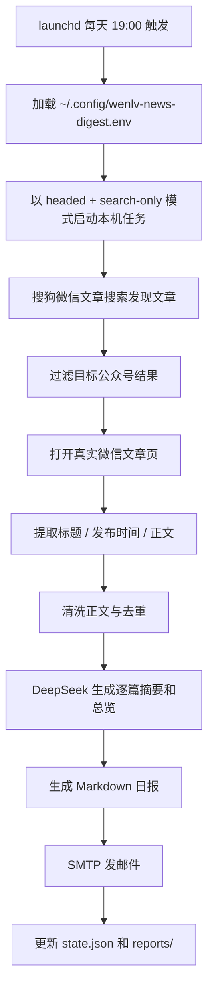

# 文旅公众号日报器项目复盘

## 1. 项目目标

这个项目一开始想解决的不是“能不能抓到公众号文章”这么窄的问题，而是想把整条链路做完整：

- 监控指定公众号是否有新文章
- 抓取真实文章正文
- 调用 DeepSeek 生成摘要
- 输出 Markdown 日报
- 发邮件到指定邮箱
- 每天自动执行，尽量不需要人工干预

实际接入的公众号有两个：

- `数字文旅观察`
- `上海文旅产业研究院`

## 2. 第一版设想：直接监控公众号主页

最初的理想路线非常直接：

1. 用 `Playwright` 启动持久化浏览器
2. 复用登录态访问公众号主页
3. 从主页读取最近文章列表
4. 打开文章页抓正文
5. 生成摘要并发邮件

这条路理论上最干净，因为它不依赖第三方搜索，也不依赖额外服务。

但实际联调很快证明，这条路在桌面浏览器环境里走不通。

## 3. 第一个硬限制：公众号主页在桌面浏览器里不可用

真实情况是：

- 文章页 `mp.weixin.qq.com/s?...` 可以打开
- 公众号主页 `profile_ext` 在桌面浏览器里会返回“请在微信客户端打开链接”

这意味着“公众号主页监控”不是代码没写好，而是平台入口本身不可访问。

这里是整个项目最重要的第一次判断：

> 当官方入口在当前运行环境下根本不可访问时，继续围绕那个入口调代码没有意义，应该立刻拆开能力边界。

于是项目被拆成两个独立问题：

- **如何发现新文章**
- **如何抓取文章正文**

## 4. 第一轮替代：搜狗负责发现，微信原文负责正文

既然公众号主页不可用，但文章页本身可用，就可以把链路改造成：

1. 用搜狗微信文章搜索发现候选文章
2. 按公众号名过滤搜索结果
3. 打开候选文章，跳转到真实微信文章页
4. 从真实微信文章页提取标题、发布时间、正文
5. 用正文做摘要和日报

这个替代方案成立的关键是：

- 搜狗只负责“发现入口”
- 微信文章页负责“原文内容”

所以摘要并不是建立在第三方搜索摘要之上，而是仍然建立在真实公众号文章正文之上。

## 5. 第一轮实现时踩到的关键问题

### 5.1 中文目录导致 `npm init -y` 初始化失败

现象：

- 因项目目录名是中文，自动生成的包名非法

处理：

- 手工创建 `package.json`

教训：

- 工程初始化工具默认假设目录名可直接转成 npm package name，中文目录下经常需要手工收口

### 5.2 从种子文章推导主页 URL 时丢失 `__biz`

现象：

- 生成了无效的主页链接

处理：

- 改为从文章页稳定提取 `bizId`
- 增加测试锁住这个问题

教训：

- 微信相关 URL 的“看起来像规律”并不稳，能从真实页面提取的字段不要靠字符串猜

### 5.3 验证页误判

现象：

- 正常微信文章页被误判成“访问受限页面”

处理：

- 收紧反爬和验证页识别逻辑

教训：

- 反爬判断必须保守，否则正常页面会被程序自己误杀

### 5.4 搜狗中转链接不适合直接做去重

现象：

- 同一篇文章可能对应多个带签名参数的中转 URL

处理：

- 从真实文章页提取 `biz / mid / idx / sn`
- 重建 canonical URL 作为去重键

教训：

- 去重必须基于文章身份，不要基于临时入口链接

### 5.5 微信文章页是延迟渲染的

现象：

- 页面已经打开，但标题、发布时间、正文节点还没准备好

处理：

- 增加页面就绪等待

教训：

- 抓取不是“能打开页面”就结束，页面真正可提取和页面已加载是两回事

## 6. 本机版为什么能用

第一轮做完后，本机 Mac 版本已经能跑通：

- 搜狗发现文章
- 微信文章页抓正文
- DeepSeek 摘要
- Markdown 日报
- SMTP 发邮件
- `launchd` 每天 `19:00` 触发

这一版的关键前提是：

- 电脑开机
- 当前用户已登录桌面会话
- 可以短暂拉起有界面浏览器

也就是说，这一版并不是“完全无人值守”，而是“本机有人类使用环境时的自动化”。

## 7. 为什么想做到“任何情况下都自动发邮件”会很麻烦

这是整个项目后半段最核心的经验。

用户真正想要的是：

> 无论电脑开不开、人在不在、有没有桌面环境，系统都能自己每天把邮件发出来。

这件事之所以麻烦，不是因为“还差一点代码”，而是因为它同时叠加了 4 类现实限制。

### 7.1 运行环境限制

本机 `launchd + headed Playwright` 的方案依赖：

- 有 GUI 浏览器
- 有登录桌面会话
- 有本地浏览器持久化状态

所以它天然不能覆盖：

- 电脑关机
- 用户退出登录
- 无桌面的纯云服务器

### 7.2 搜狗反爬限制

搜狗搜索在本机 `headed` 模式还能相对稳定，但在云端 headless 环境下更容易触发：

- `page.goto timeout`
- 验证码
- `访问过于频繁`

所以“把本机搜狗方案原样搬到 GitHub Actions”并不是简单迁移，而是运行条件已经变了。

### 7.3 微信官方入口限制

理论上如果官方主页可用，可以避免搜狗；但前面已经验证过：

- 桌面浏览器环境里官方主页不可访问

所以项目从一开始就失去了“只走官方入口”的可能性。

### 7.4 外部发现源稳定性限制

要想让云端真正无人值守，就必须找到一个：

- 不依赖本地 GUI
- 不依赖搜狗搜索
- 能稳定输出文章 feed

这就是第二阶段引入 RSS/Atom 发现源的原因。

但这一步后来又遇到了新的现实限制：公共 RSS 服务并不稳定。

## 8. 第二阶段：尝试把发现入口改成 RSS/Atom

为了实现“电脑关机也能自动发”，项目做了第二阶段改造：

- 新增 `rssFeedUrls`
- 支持 RSS/Atom 发现文章
- GitHub Actions 定时运行
- 运行后把 `data/state.json` 和 `reports/*.md` 提交回仓库

这个阶段的核心思路是：

- 云端只负责定时执行
- 订阅源负责发现文章
- 微信文章页仍然负责正文抓取

这比“云端 headless 跑搜狗”理论上更合理，因为它绕开了 GUI 依赖和一部分反爬风险。

## 9. 第二阶段又踩到的关键问题

### 9.1 公共 RSSHub 实例返回 `403`

项目曾尝试用：

- `https://rsshub.app/wechat/uread/DCTA2024`
- `https://rsshub.app/wechat/uread/sh_act`

实际在 GitHub Actions 里返回：

- `403`

这说明：

- 代码支持 RSS 没问题
- 但公共实例本身不可靠

### 9.2 feed 失败后回退搜狗，在云端仍然不稳

最初云端模式是“feed 失败则回退搜狗”，结果又遇到：

- GitHub Actions headless 环境触发搜狗反爬

于是项目继续收口，新增了：

- 严格失败模式：来源抓取异常时直接让工作流标红
- `rss-only` 模式：GitHub Actions 不再回退搜狗

这一步的价值不是“问题解决了”，而是把问题边界说清楚了：

- 真正坏的是 feed 源
- 不是邮件、不是 DeepSeek、不是 workflow 结构

### 9.3 GitHub Actions 本身也有持久化细节

例如：

- 失败场景下 `state.json` 仍然要写回
- `git pull --rebase` 会被未提交改动挡住
- 需要 `--autostash`

这说明云端自动化不是“跑脚本”这么简单，还涉及状态持久化、失败路径和流水线一致性。

## 10. 第三阶段：尝试用 Wechat2RSS 作为正式云端发现源

当公共 RSSHub 不可靠后，项目继续往前走，预留了 Wechat2RSS 接入：

- 增加 `sync-feeds` 命令
- 支持根据 `seedArticleUrl` 调 Wechat2RSS 的 `/addurl` API
- 自动把返回的 feed URL 写回 `wenlv.config.json`

这一步其实已经很接近“真正的云端长期运行”了。

但最后仍然没有继续推进到正式上线，原因不是代码不够，而是：

- 需要自己部署或维护 Wechat2RSS
- 需要额外的服务地址、token、授权信息
- 这已经超出了“现有本机工具”的复杂度

换句话说，项目不是做不到，而是为了实现“任何情况下都自动发”，需要引入新的长期基础设施。

## 11. 为什么最后选择放弃“任何情况下都自动发”

最终放弃的不是“自动化”本身，而是放弃了“无论电脑状态如何都能自动发”这个目标。

原因可以归结为一句话：

> 要实现真正的全天候自动发送，核心难点已经不在本项目代码，而在一个长期稳定的外部发现基础设施。

具体来说，必须同时满足：

- 运行环境常开
- 文章发现入口稳定
- 不依赖 GUI
- 不被搜狗反爬
- 不依赖公共 RSS 实例的可用性
- 状态能长期持久化

这已经从“做一个本机工具”升级成了“维护一套长期在线的内容采集基础设施”。

如果继续硬推，代价会变成：

- 更多外部服务依赖
- 更多部署和维护成本
- 更多故障面
- 更高的不确定性

在当前目标下，这个复杂度不划算，所以最后做了工程上的收缩：

- 放弃“电脑关机也能自动发”
- 回到“电脑开机并登录桌面时自动发”

这是一次主动收缩，不是失败。

## 12. 最终保留的方案

最后保留的是最稳、最可控、已经实测通过的本机方案：

当前这条链路的前提是：

- Mac 开机
- 用户已登录桌面会话
- 到点时不要休眠

但它的优点也很明确：

- 已经实测通过
- 抓取准确性高于云端公共 feed 方案
- 不依赖不稳定的公共 RSS 服务
- 不需要维护额外云基础设施

## 13. 项目最终状态

按目标拆分，现在的结果是：

- **本机自动化日报**：完成
- **抓取、摘要、邮件发送**：完成
- **GitHub Actions 长期无人值守**：未采用
- **任何情况下都自动发**：主动放弃

放弃的原因不是“不会做”，而是：

- 官方主页不可访问
- 搜狗云端反爬严重
- 公共 RSS 实例不稳定
- 自建 feed 基础设施的复杂度超出当前项目目标

## 14. 这次项目最值得保留的经验

### 14.0 自动化里的“测试发送”和“正式发送”必须分开

这次本机版真正跑起来后，又暴露了一个非常典型的运行态问题：

- 白天为了联调，手动执行了 `report --send-email`
- 晚上 `19:00` 的 `launchd` 任务也正常启动了，浏览器也自动拉起了
- 但 QQ 邮箱没有再收到正式日报

最后排查出来，不是 `launchd` 没跑，也不是 SMTP 失败，而是状态文件里已经记了当天 `emailedAt`，导致定时任务判断“今天已经发过”，于是跳过发送。

这件事的本质不是 bug，而是产品语义没有分清：

- **测试发送**：验证抓取、摘要、邮件链路是否通
- **正式发送**：占用当天日报名额，后续调度不再重复发

如果不把这两者分开，就会出现一种非常迷惑的现象：

- 用户明明看到浏览器自动打开了，说明定时任务真的跑了
- 但邮箱没有新邮件，看起来像“自动发送失败”
- 实际上只是“白天测试邮件把晚上正式发送资格占掉了”

所以后来项目补了一个很重要的运行规则：

- `report --send-email` 默认只做测试发送，不写入当天正式发送标记
- 只有定时任务，或者手动显式加 `--mark-as-sent`，才会把本次发送记为当天正式发送

这个调整的价值很大，因为它把“联调动作”和“生产动作”彻底分开了。

### 14.1 不要把“自动化”理解成一个单点能力

自动化至少分成三层：

- 能发现数据
- 能稳定运行
- 能在目标运行环境下长期执行

其中第三层经常比前两层更难。

### 14.2 平台限制是系统设计输入，不是代码 bug

像“请在微信客户端打开链接”这种限制，不应该被当成“再调一调就能过”的 bug，而应该立即进入架构调整。

### 14.3 最稳的方案不一定最理想，但必须最符合当前约束

对这个项目而言，最理想的是：

- 云端常开
- 自动发现
- 无头运行
- 完全无人值守

但在真实限制下，最稳的反而是：

- 本机 `launchd`
- `headed`
- `search-only`
- 电脑开机时自动发

这是一个典型的工程取舍：

- 不是追求理论最优
- 而是追求在当前约束下的真实可用

### 14.4 真正困难的不是“写出抓取脚本”，而是“找到长期稳定的运行边界”

本项目后半段的所有困难，几乎都不是单纯的代码实现问题，而是：

- 平台访问限制
- 反爬
- 云端与本机运行条件差异
- 第三方服务稳定性
- 状态持久化

这也是为什么最后会得出一个看起来“退了一步”、但实际上更成熟的结论：

> 如果一个方案在理论上更自动，但现实中故障面更多、维护成本更高、成功率更低，那么它未必比一个受限但稳定的本机方案更好。

## 15. 第四阶段：从公众号监控到多源情报聚合

前三阶段解决了"微信公众号文章怎么抓"和"怎么自动发"的问题。第四阶段的目标是扩大信息覆盖面——不只盯公众号，还要覆盖新闻网站、政策门户、行业垂直站点。

### 15.1 为什么要做多源

公众号更新频率低，且受限于微信生态。文旅行业的关键信息同时分布在：

- 界面新闻、澎湃等综合新闻网站
- 中国政府网、文旅部等政策发布门户
- 迈点、执惠等行业垂直站点

如果只盯公众号，会错过大量行业动态。

### 15.2 新增来源类型的设计

项目在 `sourceSchema` 中新增了 `sourceType` 字段，区分四种来源：

| sourceType | 发现方式 | 抓取方式 | 典型场景 |
|------------|---------|---------|---------|
| `wechat` | 搜狗搜索 + RSS | Playwright | 微信公众号 |
| `news-site` | RSS | cheerio（从 RSS 正文） | 界面新闻 |
| `policy` | RSS | cheerio（从 RSS 正文） | 中国政府网 |
| `scrape` | HTML 列表页 | cheerio + fetch | 迈点、执惠 |

`news-site` 和 `policy` 本质上复用了 RSS 解析能力，只是加了 `keywordFilter` 做内容过滤。`scrape` 则是全新能力，需要针对每个站点写专门的 HTML 解析逻辑。

### 15.3 scraper.ts 为什么用 cheerio + fetch 而不是 Playwright

微信公众号必须用 Playwright，因为文章页需要浏览器渲染。但新闻网站的列表页和文章页都是纯服务端渲染的 HTML，用 cheerio + fetch 就够了：

- 轻量：不需要启动浏览器进程
- 快：纯 HTTP 请求 + DOM 解析，比 Playwright 快一个数量级
- 稳：没有反爬、验证码、延迟渲染等问题

这是一个典型的能力分层决策：能用轻方案解决的，不要上重方案。

### 15.4 keywordFilter 机制

非公众号来源（如界面新闻·文化）的文章范围很杂，不一定都和文旅相关。项目在 `feed.ts` 中新增了 `filterCandidatesByKeywords` 函数，在 RSS 解析后、正文抓取前做一轮关键词过滤：

- 对候选文章的标题、摘要、来源名做大小写不敏感的关键词匹配
- 配置示例：`"keywordFilter": ["文旅", "旅游", "景区", "文化", "博物馆", "非遗"]`
- 只要命中任一关键词即保留

这个过滤足够轻量，且完全配置化，新增来源时只需在 config 中声明关键词即可。

### 15.5 HTTP API 服务（server.ts）

为了支持外部系统（如 Claude Code Skill）查询文章和日报数据，项目新增了一个轻量 HTTP API 服务：

- 用 Node.js 原生 `http` 模块实现，无额外依赖
- 提供公开接口（文章查询、日报获取）和管理接口（触发采集、生成日报）
- 默认监听 `localhost:3457`，通过 `npm run serve` 启动

这个服务的设计原则是"读多写少"——公开接口都是读操作，管理接口才涉及写操作，且管理接口不做鉴权（因为只在本地使用）。

### 15.6 当前状态总结

| 维度 | 状态 |
|------|------|
| 数据源 | 7 个（2 公众号 + 3 新闻/政策 + 2 行业站点） |
| 发现方式 | 搜狗搜索、RSS/Atom、HTML 爬虫三种并存 |
| 运行模式 | 本机 launchd + GitHub Actions + HTTP API |
| 日报产出 | 24 期（2026-03-24 至 2026-05-15） |
| 测试覆盖 | 11 个测试文件 |
