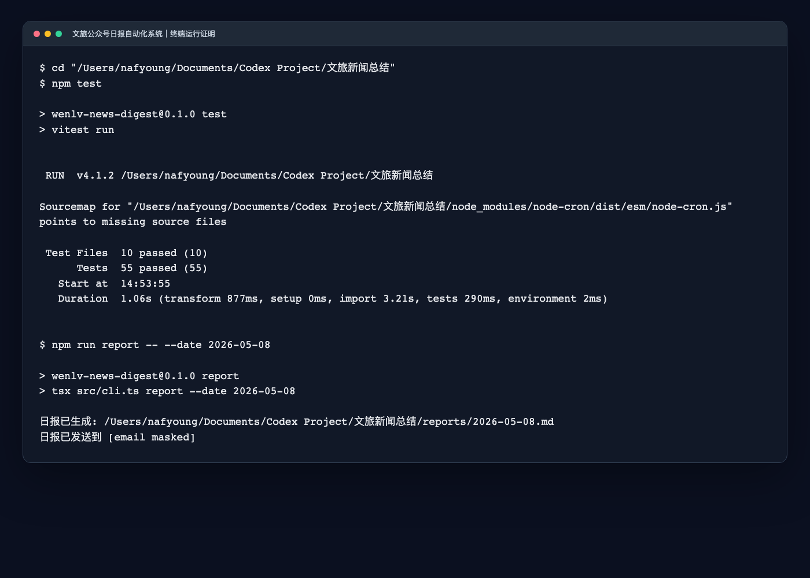
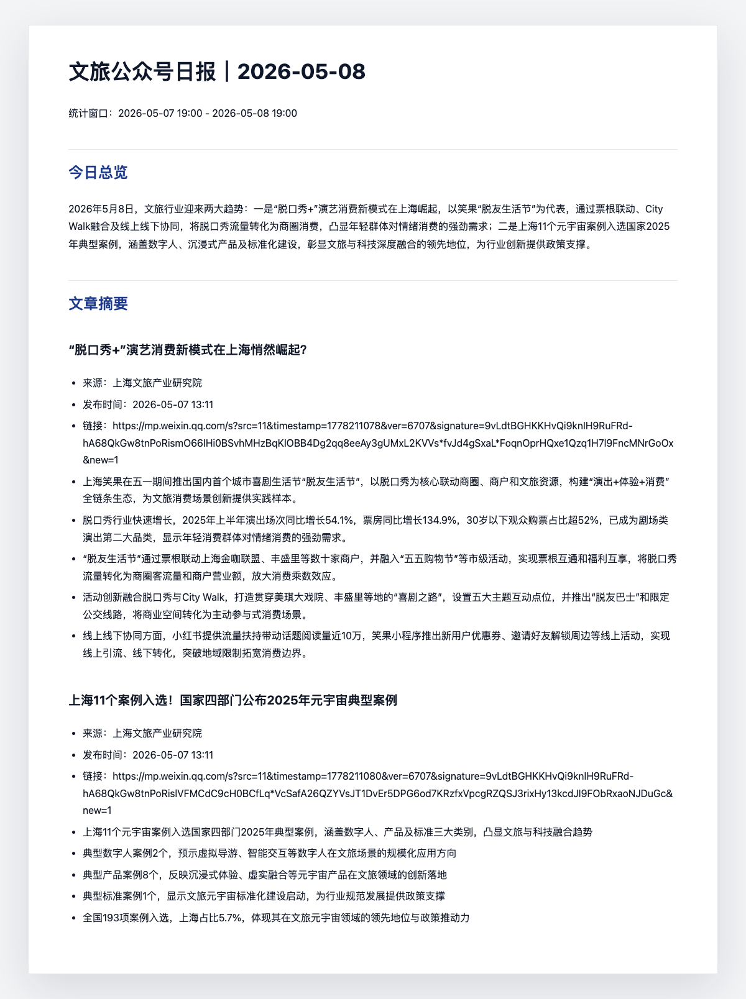

# 文旅公众号日报器

一个运行在本机 Mac 上的 Node.js 工具：从微信公众号、新闻网站、政策门户等多源渠道自动采集文旅行业资讯，调用 DeepSeek 生成结构化日报，并通过 SMTP 发邮件。同时提供 HTTP API，支持外部系统查询文章与日报数据。

现在支持三种运行模式：

- `本机模式`：搜狗搜索发现文章，适合你当前这台 Mac
- `云端模式`：RSS/Atom 订阅源发现文章，适合 GitHub Actions 或常开云主机
- `API 模式`：启动 HTTP 服务，供 Claude Code Skill 或其他系统调用

## 项目成果与使用证明

这个项目面向"文旅行业信息分散、人工盯更新和整理日报效率低"的痛点，搭建了一条从多源内容发现到邮件分发的 AI 自动化工作流：

```text
定时触发 -> 多源文章发现 -> 正文抓取 -> 清洗去重 -> 关键词过滤 -> DeepSeek 逐篇摘要 -> 日报总览生成 -> Markdown 归档 -> 邮件分发 -> 状态持久化
```

核心能力：

- 用 Playwright/RSS/新闻网站爬虫发现并抓取目标来源文章，保留真实原文链接。
- 支持微信公众号（搜狗搜索 + RSS）、新闻网站（界面新闻、迈点、执惠）、政策门户（中国政府网）等多种来源类型。
- 用 `keywordFilter` 对非公众号来源做关键词过滤，确保只采集文旅相关内容。
- 用 DeepSeek 生成逐篇摘要和当天总览，并输出 Markdown 日报。
- 用 `state.json` 记录已处理文章、失败来源、日报发送状态，避免重复发送。
- 提供 HTTP API（`npm run serve`），支持文章查询、日报获取、触发采集等操作。
- 支持本机 `launchd` 兜底和 GitHub Actions 云端定时运行。
- 已加入测试覆盖，包含抓取、状态、配置、日报、RSS、爬虫和工作流等关键逻辑。

运行证明：



日报产物示例：



## 已实现的命令

```bash
npm run bootstrap
npm run check
npm run check -- --discovery-mode rss-only
npm run sync-feeds -- --dry-run
npm run report -- --date 2026-04-01
npm run report -- --date 2026-04-01 --send-email
npm run report -- --date 2026-04-01 --send-email --mark-as-sent
npm run run-daily
npm run serve
npm run install-launchd
npm run uninstall-launchd
```

## HTTP API

`npm run serve` 启动后，默认监听 `http://localhost:3457`，提供以下端点：

| 方法 | 路径 | 说明 |
|------|------|------|
| GET | `/api/public/items?since=<ISO>&take=50&q=<keyword>&category=<id>` | 查询文章列表 |
| GET | `/api/public/daily` | 获取今日日报 |
| GET | `/api/public/daily/{YYYY-MM-DD}` | 获取指定日期日报 |
| GET | `/api/public/dailies?take=30` | 获取历史日报列表 |
| GET | `/api/public/health` | 健康检查 |
| POST | `/api/admin/check` | 触发一次采集 |
| POST | `/api/admin/report?date=YYYY-MM-DD&send-email` | 触发日报生成 |

## 数据源

当前配置了 5 类数据来源：

| 来源 | 类型 | 发现方式 |
|------|------|----------|
| 数字文旅观察 | 微信公众号 | 搜狗搜索 + RSS |
| 上海文旅产业研究院 | 微信公众号 | 搜狗搜索 + RSS |
| 界面新闻（文旅 / 文化） | 新闻网站 | RSS + 关键词过滤 |
| 中国政府网·政策 | 政策门户 | RSS + 关键词过滤 |
| 迈点 / 执惠 | 行业网站 | HTML 爬虫（scraper） |

新增来源只需在 `wenlv.config.json` 的 `sources` 数组中添加配置项，支持 `wechat`、`news-site`、`policy`、`scrape` 四种 `sourceType`。

## 环境变量

```bash
export DEEPSEEK_API_KEY=your_deepseek_key
export SMTP_HOST=smtp.example.com
export SMTP_PORT=465
export SMTP_USER=your_user
export SMTP_PASS=your_password
export MAIL_TO=your@email.com
export MAIL_FROM="文旅公众号日报 <your@email.com>"
```

可选的 Wechat2RSS 集成环境变量：

```bash
export WECHAT2RSS_BASE_URL=https://your-wechat2rss.example.com
export WECHAT2RSS_TOKEN=your_wechat2rss_token
```

## 首次使用

1. 如果你需要保留本机私有配置，先复制一份本地文件：

```bash
cp wenlv.config.example.json wenlv.config.local.json
```

说明：

- CLI 默认会按 `wenlv.config.local.json -> wenlv.config.json` 的顺序查找配置文件。
- 建议把你自己的 `email.from`、浏览器目录等本机信息放到 `wenlv.config.local.json`，不要直接改公开模板。

2. 编辑配置文件中的 `email.from`，必要时调整 `browserProfilePath`。
3. 运行 `npm run bootstrap`，首次建议保持有界面模式，完成微信登录或确认浏览器持久化目录可用。
3. 运行 `npm run check` 检查能否抓到新文章。
4. 运行 `npm run report -- --date YYYY-MM-DD --send-email` 生成并发送指定日期日报。
5. 运行 `npm run run-daily` 持续驻留，在每天 `20:30` 执行本机兜底发送。

补充说明：

- `npm run report -- --date YYYY-MM-DD --send-email` 默认是"测试发送"，会发邮件，但不会把这次发送记成当天正式发送。
- 如果你希望手动补发后，系统把它视为当天正式发送，请使用 `--mark-as-sent`。
- `run-daily` / `launchd` 触发的每日任务会自动把当天成功发送记为正式发送。
- 本机 `run-daily` / `launchd` 即使当天无新文章，也会发送一封状态邮件，便于确认无人值守链路按时运行。
- GitHub Actions 如果没有从 RSS 中发现新文章，只会生成状态报告并提交运行状态，不会发送空邮件，也不会阻止 20:30 的本机兜底复核。
- `dailyReportTime: 19:00` 只定义日报统计窗口截止时间，不代表实际发送时间。
- 当前默认采用"双通道"：GitHub Actions 在 `20:15` 做云端主发送，本机 `launchd` 在 `20:30` 做兜底；只有云端已经发出包含文章的正式日报时，本机才会跳过。

## Wechat2RSS 接入

如果你要做长期无人值守的云端模式，推荐把 `rssFeedUrls` 切到你自己的 Wechat2RSS 实例。

最短流程：

1. 先按官方文档部署 Wechat2RSS，并完成授权与域名配置。
2. 在本地配置：

```bash
export WECHAT2RSS_BASE_URL=https://your-wechat2rss.example.com
export WECHAT2RSS_TOKEN=your_wechat2rss_token
```

3. 先预览同步结果：

```bash
npm run sync-feeds -- --dry-run
```

4. 确认没问题后写回配置文件：

```bash
npm run sync-feeds
```

这个命令会用每个 `source.seedArticleUrl` 调 Wechat2RSS 的 `/addurl` API，并把返回的 feed URL 写回 `wenlv.config.json` 的 `rssFeedUrls`。

## 云端模式（第二阶段）

如果你希望"电脑关机后也能自动发"，不要再依赖本机 `launchd`。第二阶段的推荐做法是：

1. 给每个 `source` 配置 `rssFeedUrls`
2. 把仓库推到 GitHub
3. 在仓库 Secrets 里配置：
   - `DEEPSEEK_API_KEY`
   - `SMTP_HOST`
   - `SMTP_PORT`
   - `SMTP_USER`
   - `SMTP_PASS`
   - `MAIL_TO`
   - `MAIL_FROM`（推荐；用于覆盖公开模板里的发件人）
4. 启用 `.github/workflows/daily-digest.yml`

说明：

- 云端模式优先使用 RSS/Atom 中携带的全文生成日报，避免在 GitHub Actions 里打开真实微信文章页触发访问限制。
- 当前仓库里的 GitHub Actions 工作流会在北京时间 `20:15` 定时执行，也支持手动触发。
- GitHub Actions 采用"部分成功可发送"策略：只要至少一个源抓到新文章，就会发送日报；失败源会写进"抓取异常"段落，但不再整体阻断发信。
- GitHub Actions 现在会强制使用 `rss-only` 发现模式，不再回退到搜狗搜索，避免 headless 环境下的搜狗反爬噪音。
- 云端 `rss-only` 模式会跳过订阅源里的 `weixin.sogou.com/link` 搜狗跳转链接，也会跳过未携带全文的直接微信链接；要稳定运行，订阅源最好直接返回 `mp.weixin.qq.com` 原文链接，并在 `content:encoded`、`content` 或足够长的 `description` 中携带正文。
- 工作流会把 `data/state.json` 和 `reports/*.md` 提交回仓库，确保"已处理文章"状态能跨天持久化。
- 如果不持久化状态，第二天运行会把同一批旧文章再次算作新文章。

`rssFeedUrls` 是第二阶段的关键配置。当前代码支持任意 RSS/Atom 订阅源；云端无人值守模式要求 feed 条目链接直接指向真实公众号文章页，并携带可读正文。

注意：

- 如果同时配置了 `rssFeedUrls` 和 `searchQuery`，程序会先试订阅源，失败后再回退到搜狗搜索。
- 如果使用 `--discovery-mode rss-only`，程序只会使用 `rssFeedUrls`，不会回退到搜狗。
- 公共 RSSHub 实例可作为起点，但稳定性不保证。要做长期无人值守，最好改成你自己的 RSSHub 实例或你确认稳定的第三方实例。
- 如果你已经部署了 Wechat2RSS，推荐直接用 `npm run sync-feeds` 把 `rssFeedUrls` 换成自己的实例返回值。

## macOS 自动化

项目提供了 `launchd` 安装脚本，会在当前用户下创建 `com.nafyoung.wenlv-news-digest` 定时任务，每天北京时间 `20:30` 执行本机兜底发送，并额外每 30 分钟补跑一次，避免 Mac 睡眠错过固定时间后完全不执行。

注意：

- 自动化任务会以 `headed` 模式短暂拉起浏览器窗口，以降低搜狗微信搜索反爬概率。
- 30 分钟补跑不会重复发信；当天已有正式发送记录时，任务会按状态直接跳过。
- 自动化任务不会直接使用你当前工作区，而是先同步 GitHub `origin/main` 到独立 automation runtime，再根据 canonical state 判断是否需要兜底发送。
- 安装脚本会把本机配置和浏览器 profile 放到 `~/.codex/automation-runtimes/wenlv-news-digest/`，避免 launchd 后台进程被 macOS 的 Documents 隐私权限拦截。
- 执行时需要当前 macOS 用户处于已登录桌面会话；如果完全退出登录，GUI 浏览器无法正常启动。
- 白天手动执行 `report --send-email` 做联调，不会影响晚上正式发送；只有显式加 `--mark-as-sent`，才会占用当天正式发送资格。

1. 先把环境变量写到 `~/.config/wenlv-news-digest.env`
2. 再运行：

```bash
npm run install-launchd
```

卸载：

```bash
npm run uninstall-launchd
```

日志默认写到：

- `~/Library/Logs/wenlv-news-digest/launchd.stdout.log`
- `~/Library/Logs/wenlv-news-digest/launchd.stderr.log`

## 目录说明

- `src/`：命令行、抓取、摘要、日报、邮件和 API 逻辑。
  - `wechat.ts`：微信公众号文章发现与抓取（搜狗搜索 + Playwright）
  - `scraper.ts`：新闻网站爬虫（迈点、执惠等，cheerio + fetch）
  - `feed.ts`：RSS/Atom 订阅源解析与关键词过滤
  - `server.ts`：HTTP API 服务
  - `workflow.ts` / `pipeline.ts`：主流程编排
  - `deepseek.ts`：DeepSeek 摘要生成
  - `digest.ts` / `report.ts`：日报拼装与归档
  - `email.ts`：SMTP 邮件分发
  - `state.ts`：状态持久化
  - `config.ts`：配置加载与校验
- `data/state.json`：运行态，保存已处理文章、失败记录和日报发送状态。
- `reports/YYYY-MM-DD.md`：日报归档。
- `wenlv.config.json`：公开模板配置，适合放进仓库。
- `wenlv.config.local.json`：本机私有配置，优先级高于公开模板，默认不提交。
- `wenlv.launchd.env.example`：`launchd` 使用的环境变量模板。

## 配置示例

`wenlv.config.example.json` 展示了多种来源类型的配置方式：

- `sourceType: "wechat"`：微信公众号，走搜狗搜索 + RSS
- `sourceType: "news-site"`：新闻网站，走 RSS + 关键词过滤
- `sourceType: "policy"`：政策门户，走 RSS + 关键词过滤
- `sourceType: "scrape"`：行业网站，走 HTML 爬虫

如果同时配置了 `rssFeedUrls`，程序会优先使用订阅源发现文章。`keywordFilter` 可用于对非公众号来源做内容过滤，只保留包含指定关键词的文章。
